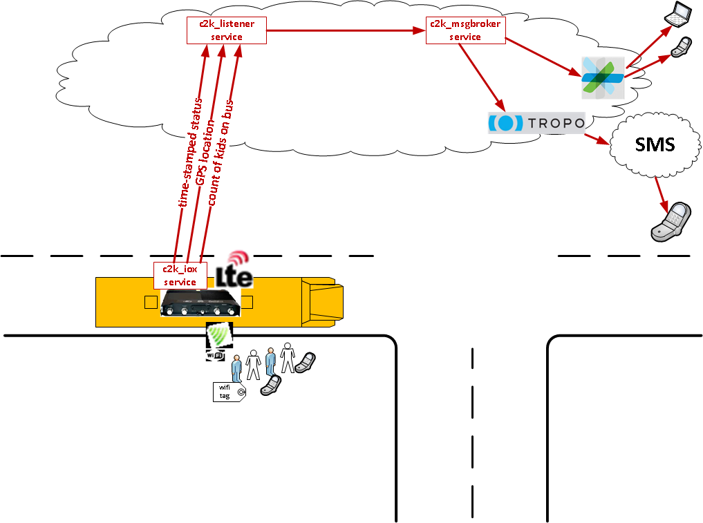

# Cisco Kiddie Kounter (C2K): IOx App

Cisco Kiddie Kounter (C2K) is a sample demonstration application that illustrates how several technologies from Cisco can be brought together to address a business problem.  

## Demo Application Background

The initial problem to be solved is to to count the kids on the school bus.  Additional capabilities include tracking school bus location and notifying school administrators and parents.  No more kids left sleeping on the bus!



The total application consists of the following services:

* [c2k_demo](https://github.com/imapex/c2k_demo) - Full Demo Application Setup and Details
* [c2k_iox](https://github.com/imapex/c2k_iox) - Details on the Cisco IOx Client Application
* [c2k_listener](https://github.com/imapex/c2k_listener) - Centralized services for receiving bus updates from IoX and maintaining database
* [c2k_msg](https://github.com/imapex/c2k_msg) - Messaging services via Cisco Spark or Tropo

# c2k_iox 

This repository provides the code and details for the Cisco IOx Application that monitors GPS Location and WLAN clients on a Cisco C819HG-4G-G-K9 IoX Router in a school bus and periodically reports status to the C2K Listener.

### Table of Contents 

* [Setup and PreRequisites](#setup-and-prerequisites)
* [Loading Demo Application](#loading-demo-application)

# Setup and PreRequisites 

To build and replicate this demonstration you'll need access to an IOx device. The original demonstration was created using a Cisco 829 router.

## IOx Router/Host 

[Cisco DevNet IOx Community](https://developer.cisco.com/site/iox/index.gsp) is the best place for resources on developing with IOx.  Before beginning this, or any other IOx app project, you can find information on preparing your router.  This includes: 

* installing the correct IOS image 
* configuring IOS to enable IOx 
* loading the necessary cartridges for running applications

This demonstration runs as a Python PaaS application, so follow the [PaaS QuickStart](https://developer.cisco.com/media/iox-dev-guide-7-12-16/getstarted/quickstart-paas/) preparation for that demonstration.  

# Loading Demo Application

Begin by cloning the c2k_iox repository to your local machine.  

```
git clone https://github.com/imapex/c2k_iox

# View the contents of the repo, you should see something similar
ls
README.md			deploy.sh			activation.json

```

## IOx PaaS Application

Follow these steps to properly package and deploy c2k_iox to your device.  This assumes you already have installed and setup ioxclient on your local machine.  For information on how to do that, see [ioxclient-reference](https://developer.cisco.com/media/iox-dev-guide-7-12-16/ioxclient/ioxclient-reference/) on DevNet.  

*All of these steps will be accomplished from a terminal on your workstation*

1. Look at your c2k_iox app directory.  You should see the following files.  

	```
	ls -la
	```
	
	| File | Description |
	| --- | --- | 
	| package.yaml | YAML formatted description of the IOx application |
	| sample_package_config.ini | Application configuration file (empty) | 
	| activation.json | Host Router Device Mapping (ie network and serial) | 
	| requirements.txt | Python requirements list | 
	| main.py | Python code to run for application | 
	

2. The `sample_package_config.ini` file is a template for the required configuration file for the IOx application.  Make a copy of this file that you will customize for your deployment.  

    ```
    cp sample_package_config.ini package_config.ini
    ```
    
3. Open the newly created `package_config.ini` file and update it as indicated here.  

```
[myapp]
name: c2k_iox
email: <your email address>    <-- Insert your email address

[logging]
# DEBUG:10, INFO: 20, WARNING: 30, ERROR: 40, CRITICAL: 50, NOTSET: 0
log_level: 10
# Enable/disable logging to stdout
console: yes
```    

4. Create an IOx application package that can be installed to your host device.  

	```
	ioxclient package .
	Currently active profile :  c2k_iox
	Command Name: package
	Checking if package descriptor file is present..
	Validating descriptor file /Users/cwood/Github/c2k_iox/package.yaml with package schema definitions
	Parsing descriptor file..
	Found schema version  2.0
	Loading schema file for version  2.0
	Validating package descriptor file..
	File /Users/cwood/Github/c2k_iox/package.yaml is valid under schema 	version 2.0
	Created Staging directory at :  /var/folders/my/9ks9sft126sgvxkvy2lxz19c0000gn/T/791050157
	Copying contents to staging directory
	Checking for application runtime type
	Detected Python application. Attempting to install dependencies present in requirements.txt ..
	Collecting spark-python==0.0.6 (from -r requirements.txt (line 1))
	Collecting requests==2.9.1 (from -r requirements.txt (line 2))
    Using cached requests-2.9.1-py2.py3-none-any.whl
	Collecting PyYAML==3.12 (from -r requirements.txt (line 3))
	Installing collected packages: requests, spark-python, PyYAML
	Successfully installed PyYAML-3.12 requests-2.9.1 spark-python-0.0.6

	Successfully installed dependencies..
	Creating an inner envelope for application artifacts
	Generated  /var/folders/my/9ks9sft126sgvxkvy2lxz19c0000gn/T/791050157/artifacts.tar.gz
	Calculating SHA1 checksum for package contents..
	Package MetaData file was not found at  /private/var/folders/my/9ks9sft126sgvxkvy2lxz19c0000gn/T/791050157/.package.metadata
	Wrote package metadata file :  /private/var/folders/my/9ks9sft126sgvxkvy2lxz19c0000gn/T/791050157/.package.metadata
	Root Directory :  /private/var/folders/my/9ks9sft126sgvxkvy2lxz19c0000gn/T/791050157
	Output file:  /var/folders/my/9ks9sft126sgvxkvy2lxz19c0000gn/T/141681960
Path:  .package.metadata
SHA1 : 1ab3ed3b06608cb4828ed4dfec8f7b22baa01be2
Path:  artifacts.tar.gz
SHA1 : 7d55c8395c38bf9abba59341f04fbd7a9e94f40e
Path:  package.yaml
SHA1 : ad6ec03d4ad9a9586bf4e61fd0e7fda788c1b0bf
Path:  package_config.ini
SHA1 : af10aa960601a7a25c40e61f5537fec516d7370c
Generated package manifest at  package.mf
Generating IOx Package..
Package generated at /Users/cwood/Github/c2k_iox/package.tar
	```

5. Install the c2k_iox package onto your router. 

	```
	ioxclient application install c2k_iox package.tar 
	
	Currently active profile :  c2k_iox
Command Name: application-install
Installation Successful. App is available at : https://76.92.194.126:8443/iox/api/v2/hosting/apps/c2k_iox 
Successfully deployed
	```
	
	* Verify application installed.
		
		```
		ioxclient application list 
		
		Currently active profile :  c2k_iox
		Command Name: application-list
		List of installed App :
		 1. c2k_iox   --->   DEPLOYED
		  
		```
6. Activate c2k_iox application 

	```
	ioxclient application activate c2k_iox --payload activation.json
	
	Currently active profile :  c2k_iox
	Command Name: application-activate
	Payload file : activation.json. Will pass it as application/json in request body..
	App c2k_iox is Activated	
	```
	
	* Check that c2k_iox is now activated
	
		```
		ioxclient application list
		Currently active profile :  default
		Command Name: application-list
		List of installed App :
		 1. c2k_iox   --->  ACTIVATED
		```

7. Start c2k_iox application.  

	```
	ioxclient application start c2k_iox 
	
	Currently active profile :  c2k_iox
	Command Name: application-start
	App c2k_iox is Started
	```

8. Connect to the console of the running application to verify it has started correctly.  If you connect immediately after starting, you may need to wait while the container boots up completely.  

   ```
   ioxclient application console c2k_iox 
   Currently active profile :  c2k_iox
Command Name: application-console
Console setup is complete..
Running command : [ssh -p 2222 -i c2k_iox.pem appconsole@76.92.194.126]
SSH client is not present on the platform.
Attempting to connect using native SSH implementation..., press Ctrl+C to exit
Connecting to appconsole@76.92.194.126:2222 using pem file c2k_iox.pem
Connected to domain c2k_iox
Escape character is ^]
INIT: version 2.88 booting
mount: permission denied (are you root?)
bootlogd: ioctl(/dev/pts/1, TIOCCONS): Operation not permitted
urandom start: failed.
rm: can't remove '/tmp/cores': Device or resource busy
rm: can't remove '/tmp': Directory not empty
dmesg: klogctl: Permission denied
hwclock: can't open '/dev/misc/rtc': No such file or directory
INIT: Entering runlevel: 5
Configuring network interfaces... udhcpc (v1.22.1) started
Sending discover...
Sending select for 192.168.1.9...
Lease of 192.168.1.9 obtained, lease time 86400
/etc/udhcpc.d/50default: Adding DNS 192.168.10.15
done.
hwclock: can't open '/dev/misc/rtc': No such file or directory
Starting syslogd/klogd: done
Poky (Yocto Project Reference Distro) 1.7.2 isr800-lxc /dev/tty1
isr800-lxc login: 2016-11-29 14:35:27,562 - myapp - INFO - Printing CAF ENV VARIABLES
2016-11-29 14:35:27,568 - myapp - INFO - CAF_APP_PERSISTENT_DIR: /data
2016-11-29 14:35:27,570 - myapp - INFO - CAF_APP_LOG_DIR: /data/logs
2016-11-29 14:35:27,573 - myapp - INFO - CAF_APP_CONFIG_FILE: /data/package_config.ini
2016-11-29 14:35:27,575 - myapp - INFO - CAF_APP_CONFIG_DIR: /data
2016-11-29 14:35:27,577 - myapp - INFO - CAF_APP_USERNAME: root
2016-11-29 14:35:27,579 - myapp - INFO - CAF_HOME: /appdir
2016-11-29 14:35:27,582 - myapp - INFO - CAF_HOME_ABS_PATH: /appdir
2016-11-29 14:35:27,585 - myapp - INFO - CAF_APP_PATH: /appdir/app
2016-11-29 14:35:27,587 - myapp - INFO - CAF_MODULES_PATH: /appdir/modules
2016-11-29 14:35:27,590 - myapp - INFO - CAF_APP_DIR: app
2016-11-29 14:35:27,594 - myapp - INFO - CAF_MODULES_DIR: modules
2016-11-29 14:35:27,596 - myapp - INFO - CAF_APP_ID: c2k_iox
201
{
  "bus": {
    "id": 10, 
    "last_checkin": "20161129-143531", 
    "last_location": "GPS Temporarily Unavailable", 
    "name": "bus0648", 
    "route": "Pulaski-87th-95th", 
    "status": "", 
    "uri": "http://imapex-c2k-c2klistener.green.browndogtech.com/api/v1.0/busses/bus0648"
  }
}
200
{
  "bus": {
    "id": 10, 
    "last_checkin": "2016-11-29T14:30:11.322433", 
    "last_location": "GPS Temporarily Unavailable", 
    "name": "bus0648", 
    "route": "Pulaski-87th-95th", 
    "status": "", 
    "uri": "http://imapex-c2k-c2klistener.green.browndogtech.com/api/v1.0/busses/bus0648"
     }
}
    ```
